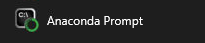
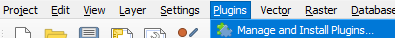
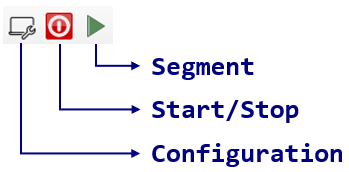
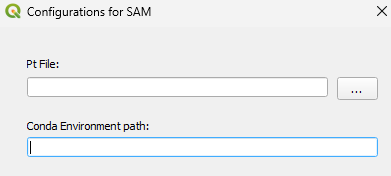
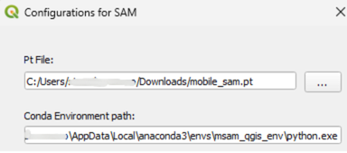
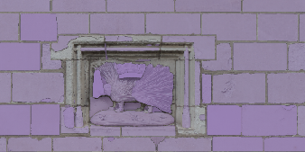
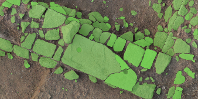

# S2S-AI QGIS Plugin

The **S2S-AI** plugin allows you to segment elements directly in QGIS using **MobileSAM**, a lightweight version of Meta AI’s Segment Anything Model (SAM). It works with Python environment and lets you generate vector masks from high-resolution geospatial imagery, suitable for applications in cultural heritage, remote sensing, and more.

---

## 🔧 Installation Guide

### 1. Prerequisites

#### 1.1 GPU

Your computer must have a graphics card (GPU)

#### 1.2 Git and Conda

Before proceeding, ensure that you have **Git** and **MiniConda** (or conda) installed:

  - Download and install **Git** from [https://git-scm.com/](https://git-scm.com/).
  - Download and install **Miniconda** from [https://www.anaconda.com/download/success#miniconda](https://www.anaconda.com/download/success#miniconda)

---

### 2. Environment Setup

#### In Windows:
 - look for the **Anaconda Prompt** app.  

    

- In the opened app, copy and paste the following commands (one line at a time):

```bash
conda create --name sam_qgis_env python=3.10 -y 
conda activate sam_qgis_env
pip install torch torchvision torchaudio --index-url https://download.pytorch.org/whl/cu118
pip install opencv-python numpy flask pycocotools timm
pip install git+https://github.com/ChaoningZhang/MobileSAM.git
```

#### In Mac/Linux:
 - look for the **Terminal** app.  

    

- In the opened app, copy and paste the following commands (one line at a time):

```bash
conda create --name sam_qgis_env python=3.10 -y 
conda activate sam_qgis_env
pip install torch torchvision torchaudio
pip install opencv-python numpy flask pycocotools timm
pip install git+https://github.com/ChaoningZhang/MobileSAM.git
```

---

### 3. Plugin Installation in QGIS

- 📦 Download the plugin: [S2S-AI-MobileSAM.zip](https://github.com/stuardo-lucho/S2S-AI/releases/download/S2S-AI/S2S-AI-MobileSAM.zip)
- 🧠 Download MobileSAM: [mobile_sam.pt](https://github.com/stuardo-lucho/S2S-AI/releases/download/S2S-AI/mobile_sam.pt)  

#### Install in QGIS:

- Open QGIS 
- In the top menu select `Plugins`, then `Manage and Install Plugins…`

    

- From the left bar, select **Install from ZIP** → browse for `S2S-AI-MobileSAM.zip`
- Click **Install Plugin**
- If a warning appears, press **Yes**

---

## 🚀 How to Use the Plugin

Once installed, you will see 3 new buttons in the QGIS top bar:




### First-Time Setup:

1. Click the **Configuration** button
2. The following window will appear:

    

    Set the following:
   - **Pt File** → select `mobile_sam.pt`
   - **Conda Environment Path** → go back to the Anaconda Prompt, type and copy the output
     - On Linux/Mac: `which python`  
     - On Windows: `where python` (copy all the line that includes `sam_qgis_env`)
      

3. Click **Ok**

4. Click the **Start/Stop** button  
   → If it turns into **Stop** (green), the Plugin has started successfully

### Segmentation:

- Click the **Segment** button
- Choose:
  - Density (higher = more detailed, slower)
  - Output layer: new or existing
  - Transparency of output masks

→ The plugin will segment everything visible on the screen. Hide other layers to avoid re-segmentation.

### Important

- When done, click the **Start/Stop** button before closing QGIS.

---

## 📝 Considerations

- You only need to configure the environment path and model file once.

---

## 📸 Screenshots





---

## 📂 License

MIT


---

## 📚 Citation

If you use this plugin or dataset, please cite:

Lucho, S., Treuillet, S., Desquesnes, X., Leconge, R., & Brunetaud, X. (2024).  
**Weakly Supervised SVM-Enhanced SAM Pipeline for Stone-by-Stone Segmentation of the Masonry of the Loire Valley Castles**.  
*Journal of Imaging, 10(6), 148.* https://doi.org/10.3390/jimaging10060148

```bibtex
@article{lucho_weakly_2024,
  title = {Weakly {Supervised} {SVM}-{Enhanced} {SAM} {Pipeline} for {Stone}-by-{Stone} {Segmentation} of the {Masonry} of the {Loire} {Valley} {Castles}},
  volume = {10},
  copyright = {https://creativecommons.org/licenses/by/4.0/},
  issn = {2313-433X},
  url = {https://www.mdpi.com/2313-433X/10/6/148},
  doi = {10.3390/jimaging10060148},
  language = {en},
  number = {6},
  urldate = {2025-03-08},
  journal = {Journal of Imaging},
  author = {Lucho, Stuardo and Treuillet, Sylvie and Desquesnes, Xavier and Leconge, Remy and Brunetaud, Xavier},
  month = jun,
  year = {2024},
  pages = {148}
}
```

---

## 🙏 Acknowledgement

This project is based on and benefits from [MobileSAM](https://github.com/ChaoningZhang/MobileSAM).
